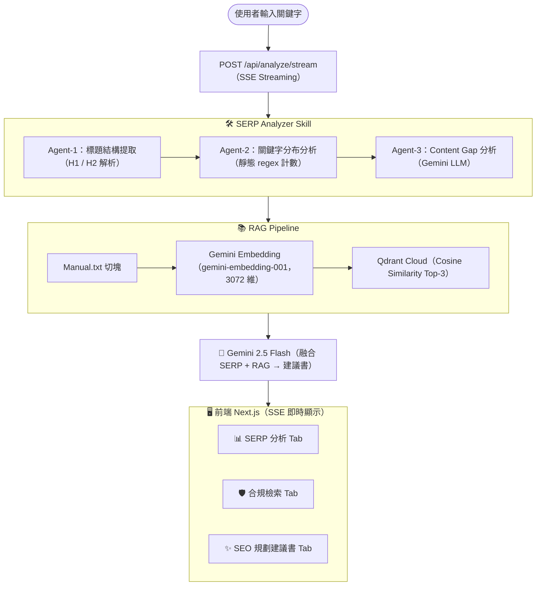

# SEO RAG Planner

> AI 驅動的 SEO 內容規劃系統，結合 **SERP 競爭分析（3 步驟分析架構）**、**RAG 合規檢索（In-Memory 向量儲存，可擴充為 Qdrant）** 與 **Gemini LLM**，自動產出符合 YMYL 規範的文章規劃建議書。

---

## 系統架構



**資料流向：** 使用者輸入 → SERP Skill（3 步驟：標題解析 → 關鍵字分析 → Gap 識別）→ RAG 向量檢索 → Gemini LLM 融合產出 → SSE 即時回傳前端

---

## 評核標準對應

| 評核標準 | 實作方式 |
|---------|---------|
| **Technical Rigor（技術嚴謹性）** | Skill 具備完整 Error Handling：SERP entry 格式驗證、4 層 JSON 修復、LLM fallback、Qdrant 連線自動降級為 In-Memory |
| **Prompt Precision（提示詞精確度）** | Prompt 明確要求 LLM 平衡「SERP Content Gap 分析」與「RAG 合規約束」，包含 5 條硬性規則（禁用語、利率標註、EEAT 差異）、動態注入當前日期 |
| **Architecture Scalability（架構可擴展性）** | Plugin 架構：新增 Skill 只需實作 `Skill` interface 並呼叫 `registry.register()`，無需改動任何現有程式碼 |

---

## 技術棧

| 元件 | 技術 |
|------|------|
| 前端 | Next.js 14 (App Router) + Vanilla CSS |
| 後端 API | Next.js API Routes + SSE Streaming |
| LLM | Google Gemini 2.5 Flash (`responseMimeType: json`) |
| Embedding | Gemini Embedding API (`gemini-embedding-001`, 3072 維) |
| 向量資料庫 | **In-Memory 向量儲存**（Cosine Similarity），可擴充為 Qdrant Cloud |
| 容器化 | Docker + Docker Compose (含熱重載) |

---

## 快速開始

### 前置需求

- [Docker Desktop](https://www.docker.com/products/docker-desktop/)
- [Gemini API Key](https://aistudio.google.com/apikey)
- [Qdrant Cloud 帳號](https://cloud.qdrant.io/)（免費 Starter Plan）

### 1. 設定環境變數

```bash
cp .env.example .env.local
```

編輯 `.env.local`：

```env
GEMINI_API_KEY=your_gemini_api_key
# 以下為可選（未設定時自動降級為 In-Memory 向量儲存）
# QDRANT_URL=https://your-cluster.qdrant.io:6333
# QDRANT_API_KEY=your_qdrant_api_key
```

### 2. Docker 一鍵啟動

```bash
docker compose up -d --build
```

### 3. 開始使用

打開瀏覽器進入 **http://localhost:3000**，直接點「開始分析」（預設關鍵字：房屋二胎利率）。

### 常用指令

| 操作 | 指令 |
|------|------|
| 啟動 | `docker compose up -d` |
| 查看日誌 | `docker logs rag-system -f` |
| 停止 | `docker compose down` |
| 重建（修改程式碼後） | `docker compose up -d --build` |
| 重啟（修改 Manual.txt 或 .env 後） | `docker restart rag-system` |

---

## 目錄結構

```
rag-system/
├── data/
│   ├── Manual.txt              # 公司內部合規手冊（RAG 知識來源）
│   └── SERP_Data.json          # SERP 競爭對手數據（5 筆模擬資料）
├── src/
│   ├── app/
│   │   ├── api/
│   │   │   ├── analyze/
│   │   │   │   ├── route.ts        # 主 API（同步版本）
│   │   │   │   └── stream/route.ts # SSE 串流 API（即時步驟輸出）
│   │   │   └── skills/route.ts     # GET /api/skills（Skill 列表）
│   │   ├── page.tsx                # 前端 UI（SSE client）
│   │   ├── layout.tsx
│   │   └── globals.css
│   └── lib/
│       ├── skills/
│       │   ├── serpAnalyzer.ts          # SERP Analyzer Skill（3 步驟分析）
│       │   │   ├── Step-1: 標題結構提取（靜態解析）
│       │   │   ├── Step-2: 關鍵字分布分析（regex 計數）
│       │   │   └── Step-3: Content Gap 識別 → 呼叫 contentGapGenerator
│       │   ├── contentGapGenerator.ts   # Step-3 的 LLM 實作（被 serpAnalyzer import）
│       │   └── registry.ts              # Skill 註冊中心（Plugin 架構）
│       ├── rag/
│       │   └── pipeline.ts             # RAG：切塊 + Embedding + Qdrant 向量檢索
│       └── llm/
│           └── generator.ts            # LLM：Prompt 工程 + 4 層 JSON 容錯修復
├── Dockerfile
├── docker-compose.yml
└── .env.example                        # 環境變數範本
```

---

## SERP Analyzer Skill：3 步驟分析架構

本系統的 SERP Analyzer Skill 採用 **1 Skill → 3 個分析步驟** 的分工設計：

| 步驟 | 工作 | 方式 |
|------|------|------|
| **Step-1** 標題結構提取 | 解析競爭對手 H1/H2 標題、source_authority | 靜態演算法 |
| **Step-2** 關鍵字分布分析 | 追蹤 25 個金融關鍵字的出現頻率與佈局 | 靜態 regex 計數 |
| **Step-3** Content Gap 識別 | 分析 SERP 資料找出使用者痛點缺口 | **Gemini LLM 動態分析**（含靜態降級方案） |

設計原則：**統計型任務用演算法（確定性、零 API 成本）；推理型任務用 LLM（語義理解）**。

---

## RAG 檢索邏輯

**輸入：** 使用者的 SEO 關鍵字（如「房屋二胎利率」）

**流程：**
1. **知識庫建立（初次啟動時）**：讀取 `data/Manual.txt`，依章節切塊，呼叫 `gemini-embedding-001` 生成 3072 維向量，寫入 Qdrant Cloud
2. **語義檢索（每次分析時）**：將關鍵字同樣向量化，對 Qdrant 執行 Cosine Similarity Top-3 搜尋
3. **結果注入 Prompt**：將撈出的合規段落（章節名稱 + 內容 + 相似度）作為 RAG 上下文，約束 LLM 必須遵守

**效果：** 就算換關鍵字，系統也會自動找出最語義相關的合規章節（例如搜尋「利率」→ 優先撈第一章；搜尋「禁用語」→ 優先撈第三章）

**相似度閾值過濾（Similarity Threshold）：**
- 閾值設定為 **0.65（65%）**，低於此分數的段落視為語義無關並被過濾
- 合規手冊 Tab 會同時顯示：
  - ✓ 通過閾值的段落（藍色 badge，作為 LLM context 使用）
  - ✗ 被過濾的段落（紅色 badge，顯示分數 vs 閾值，供透明度參考）
- 完全無關的查詢（如「寶可夢」）會回傳 0 個合規文件，LLM 改用內建知識產出

---

## SERP Skill 輸入格式

Skill 讀取 `data/SERP_Data.json`，格式如下：

```json
[
  {
    "rank": 1,
    "title": "2026 房屋二胎利率總整理...",
    "h2": ["什麼是房屋二胎？", "各大銀行利率比較表"],
    "snippet": "提供全台最新房屋二胎資訊...",
    "source_authority": "High (Financial Portal)"
  }
]
```

**步驟的分工：**
- `title` → H1（Step-1）
- `h2[]` → H2 清單（Step-1）
- `title + h2 + snippet` → 關鍵字頻率計算（Step-2）
- 整筆資料 → 傳給 Gemini LLM 識別 Content Gap（Step-3）

---

## SSE 即時串流

分析過程採用 **Server-Sent Events**，每個步驟完成即即時推送到前端：

```
POST /api/analyze/stream
  → data: {"step":"serp","output":"Agent-1 完成：5 位競爭對手..."}
  → data: {"step":"serp","output":"Agent-3 完成：6 個內容缺口"}
  → data: {"step":"rag","output":"✅ 3 段合規文件（Qdrant Cloud）..."}
  → data: {"step":"llm","output":"✅ 建議書生成完成"}
  → data: {"step":"done","result":{...完整分析結果...}}
```

---

## API 端點

| 端點 | 方法 | 說明 |
|------|------|------|
| `/api/analyze/stream` | POST | SSE 串流分析（主要使用） |
| `/api/analyze` | POST | 同步分析（backup） |
| `/api/skills` | GET | 列出所有已註冊的 Skills |

---

## Prompt Precision 設計

Prompt 採用「**硬性約束 + 雙資料來源平衡**」策略：

```
1. 外部 SERP 數據 → 規劃獨家段落（針對 Content Gap）
2. 內部 RAG 合規文件 → 硬性法規約束（利率標註、禁用語、EEAT）
3. 動態注入當前時間 → 確保建議書年份正確（2026 年）
```

硬性合規約束（不可繞過）：
- ❌ 禁用語：「保證過件」、「全台最低利」、「保證核貸」、「零風險」
- ✅ 必標：所有利率描述需標「依個人信用條件而定」
- ✅ 必寫：銀行與民間代書二胎的法律權益差異

---

## 架構可擴展性：如何新增 Skill

系統採用 **Plugin 架構**，新增 Skill 只需兩步：

### Step 1：實作 Skill Interface

```typescript
// src/lib/skills/myNewSkill.ts
import { Skill, SkillResult } from './registry';

const myNewSkill: Skill = {
  name: 'my-new-skill',
  description: '我的新技能描述',
  execute: async (input?: unknown): Promise<SkillResult> => {
    const result = { /* 分析邏輯 */ };
    return {
      skillName: 'my-new-skill',
      rawData: result,
      formattedOutput: '格式化輸出供 LLM 使用',
      timestamp: new Date().toISOString(),
    };
  },
};

export default myNewSkill;
```

### Step 2：註冊到 Registry

```typescript
// src/lib/skills/registry.ts
import myNewSkill from './myNewSkill';
registry.register(myNewSkill);
```

完成！新 Skill 自動出現在 `GET /api/skills` 列表，無需修改任何其他程式碼。

---

## 環境變數

| 變數名 | 必填 | 說明 |
|--------|------|------|
| `GEMINI_API_KEY` | ✅ 必填 | Google Gemini API Key（[取得](https://aistudio.google.com/apikey)） |
| `QDRANT_URL` | ❌ 選填 | Qdrant Cloud 連線 URL（未設定自動降級為 In-Memory） |
| `QDRANT_API_KEY` | ❌ 選填 | Qdrant Cloud API Key |

> 若未設定 Qdrant 變數，系統自動降級為 In-Memory 向量儲存。

---

## License

MIT
